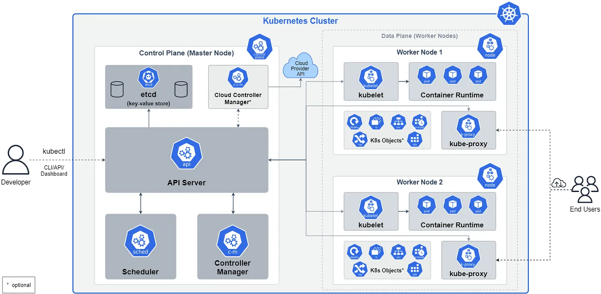

# 🚀 AWS EKS Documentation Repository  

Welcome to the **AWS EKS Documentation Repository**! This repository contains detailed guides, tutorials, and best practices for managing Kubernetes workloads on **Amazon Elastic Kubernetes Service (EKS)**.  



## 📖 Contents  

🔹 **[Pod IP Allocation in AWS EKS](EKS-pod-ip-allocation.md)**
🔹 **[Increasing ENI for Nodes in an EKS Cluster](Increase-Eni-Eks.md)** 

🔹 **Networking in AWS EKS** *(Coming Soon!)*  
🔹 **EKS Cluster Setup Guide** *(Coming Soon!)*  
🔹 **Security Best Practices in EKS** *(Coming Soon!)*  

## 🎯 What You’ll Find Here  
✅ Step-by-step AWS EKS setup guides.  
✅ Networking, security, and performance optimization tips.  
✅ Best practices for running Kubernetes on AWS.  
✅ Troubleshooting and debugging techniques.  

## 🛠 Prerequisites  
Before using these guides, ensure you have:  
- An **AWS Account** with EKS permissions.  
- **kubectl** installed:  
  ```sh
  aws eks --region <your-region> update-kubeconfig --name <cluster-name>
  
AWS CLI configured
```
aws configure
```
📌 Contribution Guidelines
Want to contribute? Follow these steps:

Fork this repository.
Clone your forked repository:
```
git clone https://github.com/your-username/aws-eks-docs.git
cd aws-eks-docs
```
⭐ Support & Feedback
If you find this repository helpful, give it a star ⭐!
For issues or suggestions, open an Issue or submit a PR.

Happy Learning! 🚀
